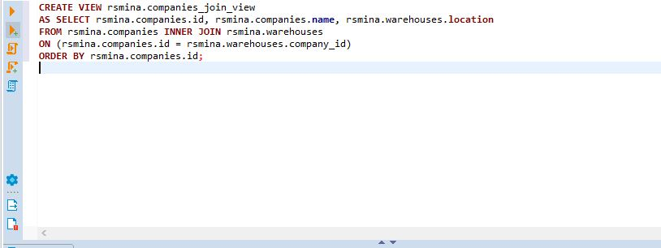
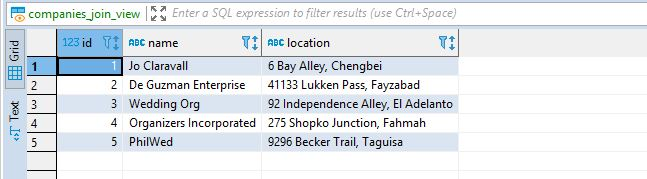
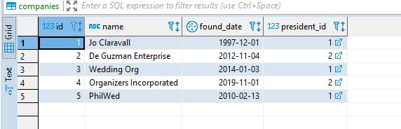
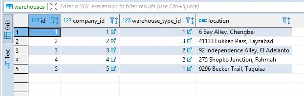
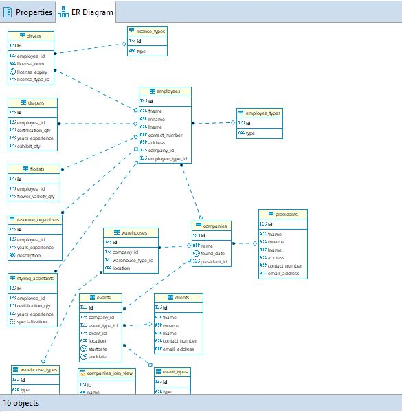

<h1> PostgreSQL Views Migrate to shared APC Server </h1>

[Create View](#create-view)

[View Table](#view-table)
 
[Companies Table](#companies)
 
[Warehouses Table](#warehouses)

[ER Diagram](#er-diagram)

[Postgres_rsmina.sql file](https://github.com/rsmina/-apc_datama2_shared_database/blob/master/projects3_postgresql_view_2tables/postgres_rsmina.sql)

# Screenshots
<h3 id="create-view">Create View</h3>

 

<h3 id="view-table">View Table</h3>

 

<h3 id="companies">Companies Table</h3>

 

<h3 id="warehouses">Warehouses Table</h3>

 

<h3 id="er-diagram">ER Diagram</h3>

[Postgres_rsmina.sql file](https://github.com/rsmina/-apc_datama2_shared_database/blob/master/projects3_postgresql_view_2tables/postgres_rsmina.sql)
